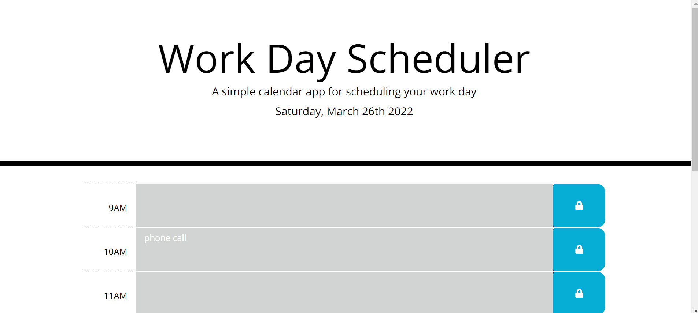

# Workday Scheduler

  

     
    <h2 align="center"><a href="https://github.com/cdfoye/Work-Day-Scheduler"><strong>Link to the GitHub Repo »</strong></a></h2>
     
    <h2 align="center"><a href="https://cdfoye.github.io/Work-Day-Scheduler/">Link to the Scheduler »</strong></a></h2>
     
     
  

<!-- PROJECT DESCRIPTION -->
<h1 align="center"> Project Description</h1>

This project enables a user to add and save tasks or events to their schedule. The current day will be displayed at the top of the page, and any text they save will remain on the page if refreshed. Current events will be highlighted in red, past events will be highlighted in gray, and future events will be highlighted in green.

 
 

<!-- ABOUT THE PROJECT -->
<h1 align="center"> About The Project</h1>

The following is a gif of the scheduler's appearance and functionality:

 

